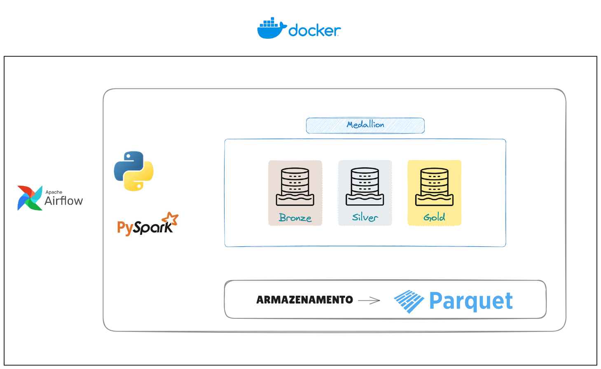

# Hero Analytics Pipeline


Este projeto consiste em um pipeline de dados para processar avaliações de heróis da marvel enviadas por usuários.
Arquitetura e Fluxo de Dados.

```bash
    Ingestão: Coleta de arquivos brutos contendo as pontuações dos usuários(Dados fakes).
    Processamento (PySpark): Limpeza, normalização e tratamento dos dados brutos.
    Armazenamento: Conversão dos dados processados para o formato Parquet (otimizando performance e custo).
    Orquestração: Gerenciamento de todo o fluxo e usando Apache Airflow.

Stack Técnica.
    Controle: Poetry
    Linguagem: Python
    Processamento: PySpark
    Orquestração: Apache Airflow
    Formato de Saída: Parquet
```
Pré-requisitos:
Antes de iniciar, certifique-se de ter instalado em sua máquina:
JDK 17
Python 3.10+
Poetry
Docker e Docker Compose


1. Executar com Docker Compose
Para subir os serviços necessários (airflow), utilize o comando:
```bash
docker-compose up -d
```

2-Após a subida, a Dag contida no path airflow/dags Estara disponivel para execução no link:
```bash
http://localhost:8080/
```

3- Log com o usuario e senha do airflow.
```bash
    usuario: USER
    senha: USER123
```